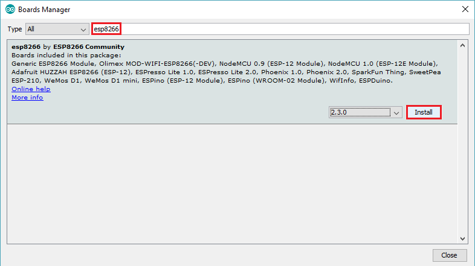
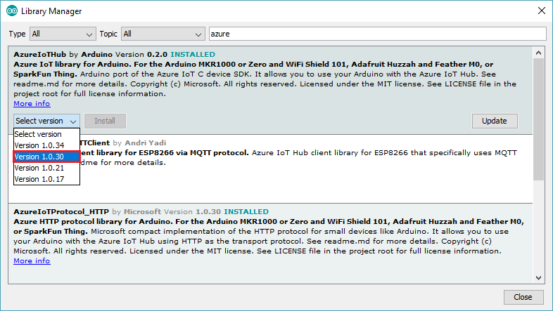
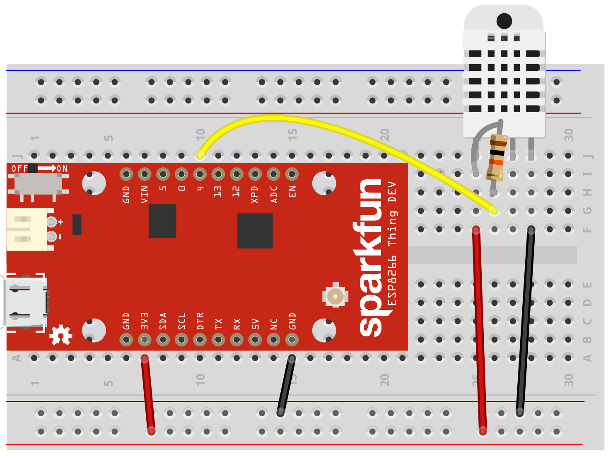
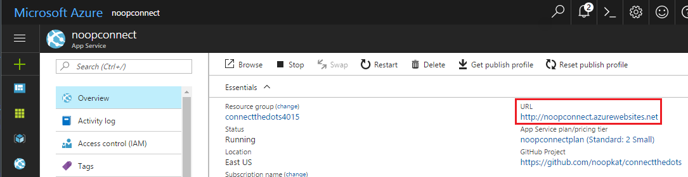

# sparkfun-azure-iot-adventure
✨🎉🌦⚡🌠
## Introduction

Thanks for joining this workshop! Today's gonna be super fun. You'll put together a basic breadboard which will communicate with a webpage to display sensor data. There are a lot of moving pieces, but your workshop guides are here to help if you get stuck. We recommend following the steps in order, however if you're waiting on downloads to finish feel free to read ahead to get familiar with what you need to do next.

We're glad you're on board! Follow the steps below to get started :sparkles:

## :computer: Install Software :computer: 

[Visual Studio Code](https://code.visualstudio.com/)

We'll be using Visual Studio code to simply edit any files thanks to it's native Node.js support and understanding of the languages we'll be using today.

[Arduino IDE](https://www.arduino.cc/en/Main/Software)

The Arduino IDE allows us to develop and program new firmware to the embedded device (ESP8266 Thing Dev).

[Git](https://git-scm.com/downloads)

Git is a free and open source distributed version control system, we'll be using it today to pull down baseline code which we'll modify to fit your project.

### :arrow_down: Download the Repository :arrow_down:
[ConnectTheDots.io](https://github.com/Azure/connectthedots) is an open source project created by Microsoft to help you get tiny devices connected to Microsoft Azure IoT and to implement IoT solutions that take advantage of Microsoft Azure and IoT Hub.

Open up a command prompt / terminal window, navigate to the desired directory for the the project and run the following command to pull down the repository:

```git clone https://github.com/noopkat/sparkfun-azure-iot-adventure```

Git is highly recommended since it is easy to track your modifications to your project. If you prefer to download a .zip file containing the project/tutorial you may download it here:

[https://github.com/noopkat/sparkfun-azure-iot-adventure/archive/master.zip](https://github.com/noopkat/sparkfun-azure-iot-adventure/archive/master.zip)

## :package: Setup Software / Board Support Package :package:
We'll need to set up the Arduino IDE to match our hardware download some libraries to start interacting with Azure / IoT Hub.

Open up your SparkFun box and insert the ESP8266 module into the breadboard as shown.

Plug in your SparkFun Think ESP8266 to an available USB port using the provided cable and turn the power ON by using the indicated switch on the device. The power LED indicator should light red.

### Install ESP8266 Board Support Package
Since the ESP8266 is a relatively new device we'll need to install some optional packages to instruct the Arduino environment on how to compile/program the board.

Open up the Arduino IDE and select `File->Preferences` to open up the preferences window and paste the following URL.
`http://arduino.esp8266.com/stable/package_esp8266com_index.json`


The Arduino IDE now is pointing at a repository contianing the necessary packages for our board, use the Boards Manager to install the `esp8266` package by selecting `Tools->Board->Boards Manager...`


Type `esp8266` into the search bar as indicated and click the install button to download the package.


Since the Board Support Package is installed our development environment we can now target the board properly, select `Tools->Board->SparkFun ESP8266 Thing Dev` in the Arduino IDE.


## :books: Install Library Dependencies :books:

For this project, we'll  need the below libraries. To install them, click on the `Sketch -> Include Library -> Manage Libraries`. Search for each library using the box in the upper-right to filter your search, click on the found library, and click the "Install" button. 

We'll be using specific versions of the Azure tools for this project, please make sure to select the appropriate version when downloading.

 - DHT Sensor Library *(latest)*
 - Adafruit Unified Sensor *(latest)*
 - ArduinoJSON *(latest)*
 - AzureIoTHub *(1.0.17)*
 - AzureIoTUtility *(1.0.17)*
 - AzureIoTProtocol_MQTT *(1.0.17)*



## :gem: Create an Azure Account :gem:
If you are taking this workshop in person you should have received a pass with $50 worth of Azure credit to get you started. You may need to create a Microsoft account at this point if you don't already have one. 

If you have an active Azure account then you may skip this step.


## :truck: Deploy Services to Azure :truck:

Once your Azure account is set up (and you're logged in!), you can go ahead and click the following magical 'Deploy to Azure' button:

[](http://azuredeploy.net/?repository=https://github.com/noopkat/connectthedots/raw/IoTHubManagement/Azure/ARMTemplate)

Fill in the details asked in the form that loads. Accepting the defaults suggested should be fine, but it's important to ensure that:

1. **IoT Hub Sku** is set to 'S1'. This is to make sure we have enough messaging allowance for today's workshop.
2. **Solution Name** - this will be used to name all of the deployed services, so make it unique but be creative!
3. **Admin Name** - who do you want to be? Zordon? Superman? WonderWoman?

See the example screenshot below:


Clicking 'Next' will validate your options and if all goes well, will also start deploying some services to your Azure account! This might take a while, so perhaps grab a coffee, or read the next steps to get familiar with them.

### Summary

What just happened on Azure? That magical 'Deploy to Azure' button took a special 'recipe' file called an ARM Template, and deployed all the services necessary for our IoT Adventure to work as expected. Let's take a look at each one:

1. **IoT Hub** - messaging broker that the SparkFun Thing Dev will post sensor data to
2. **Stream Analytics job** - aggregates data in realtime from multiple sensors and devices into data "windows"
3. **Event Hub** - takes aggregate data output from Stream Analytics and posts to any listeners
4. **Storage Account** - stores Event Hub data output
5. **Web App Service** - runs a web application to display the sensor data in graphical form, in realtime
6. **App Service Plan** - defines the scale and attributes of the Web App Service (ie. payment tier)

Ready? Okay! On to creating a new device your the IoT Hub.

## :key: Create a new IoT Hub Device :key:

Once the deployment is complete, [visit the Azure Portal](https://portal.azure.com) to see your shiny new services listed in your resources. 

Click on the IoT Hub service in the list.


We're going to create our first device in your IoT Hub! Click on 'Device Explorer'.


Next, click on the 'Add' button to start creating your device:


On the new blade that opened, come up with a name for your device, and then click 'Save' at the bottom of the blade.


Once saved, you'll see your device appear in the list of devices in the Device Explorer. Click on your new device.


You should see some keys and other information. The specific item you'll want to make a note of is the Primary Connection String. Copy that string, and paste it somewhere safe to access it easier in the next steps.


### Summary

So what's all this about? The device you just created in the IoT Hub represents your SparkFun Thing Dev board. We have told the IoT Hub about the board, and have generated some credentials for the SparkFun Thing Dev board to use when communicating with the IoT Hub. Hooray!

## :partly_sunny: Connect the Humidity Sensor to the SparkFun Thing Dev :partly_sunny:

You'll need your breadboard, a 10k Ohm resistor, the humidity sensor (the weird white waffle box), and 3 jumper wires. The signal wire of the sensor will need to be connected to pin 4. See the diagram below for how to connect the signal, ground and power pins along with the resistor:



If your breadboard looks just like the above diagram, you're good to go! Onto the next step.

## :memo: Modify the Code :memo:

Okay! We're finally ready to code the device! For your convenience, we have placed in this repository an Arduino sketch file for you, from the [Connect the Dots](https://github.com/Azure/connectthedots/blob/master/Devices/DirectlyConnectedDevices/ESP8266) project. You should be able to find it in the [`sketch` directory of this repository](./sketch). Open the `connect_the_dots.ino` file in the Arduino IDE. You'll see the file as well as two others open in tabs within the IDE. We're ready to code!

- In the `connect_the_dots.ino` file, look for the following lines of code:

```c
static char ssid[] = "[Your WiFi network SSID or name]";
static char pass[] = "[Your WiFi network WPA password or WEP key]";
```

- Replace the placeholders with your WiFi name (SSID), WiFi password, and the device connection string you created at the beginning of this tutorial. Save with `Control-s`
- Open up the file `connect_the_dots.cpp`. Look for the following lines of code and replace the placeholders connection information (this is the Device information that you've created when adding a new device id in the IoT Hub device registry):

```c
static const char* deviceId = "[deviceid]";
static const char* connectionString = "[connectionstring]";
```

- You can also change the location, organization and displayname values to the ones of your choice. Be creative!
- Save all changes

### :up::chart_with_upwards_trend: Compile and deploy the sample :chart_with_upwards_trend::up:

- Select the COM port on the Arduino IDE. Use **Tools -&gt; Port -&gt; COM** to select it.
- Use **Sketch -&gt;  Upload** on Arduino IDE to compile and upload to the device.

At this point your device should connect to Azure IoT Hub and start sending telemetry data to your Connect The Dots app. To find the URL of your deployed Web App, click on the Web App Service in your Azure Portal resource list and the URL will be shown on the 'Overview' blade:




## References

This workshop made heavy use of the Connect the Dots project; specifically, the [Arduino / ESP8266 setup](https://github.com/Azure/connectthedots/blob/master/Devices/DirectlyConnectedDevices/ESP8266/ESP8266_setup.md) portions were used. Thank you to the [authors and contributors](https://github.com/Azure/connectthedots/graphs/contributors).
